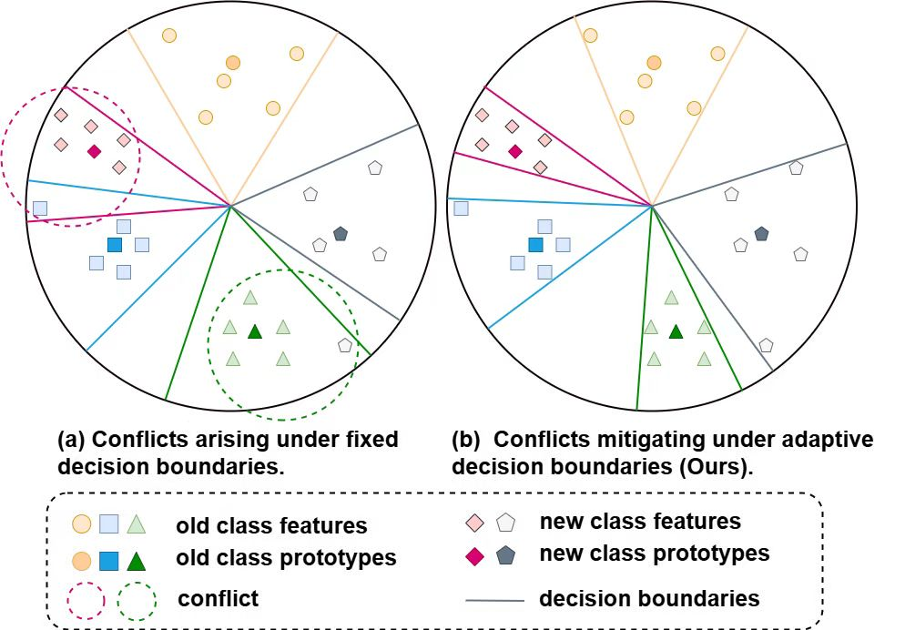
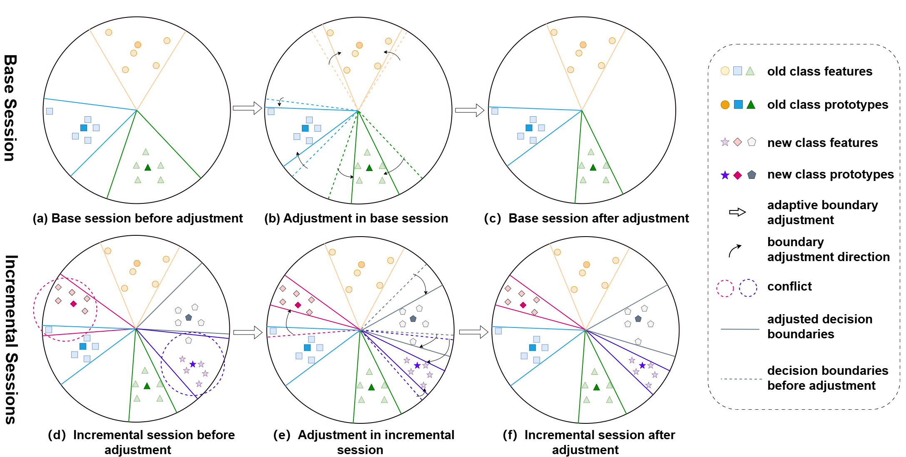
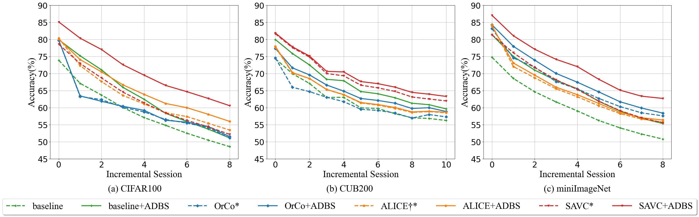

# Adaptive Decision Boundary for Few-Shot Class-Incremental Learning（ADBS）
The code repository for "Adaptive Decision Boundary for Few-Shot Class-Incremental Learning" (AAAI 2025) in PyTorch. If you use the code in this repo for your work, please cite the following bib entries:
```
@inproceedings{li2025adaptive,
  title={Adaptive Decision Boundary for Few-Shot Class-Incremental Learning},
  author={Li, Linhao and Tan, Yongzhang and Yang, Siyuan and Cheng, Hao and Dong, Yongfeng and Yang, Liang},
  booktitle={Proceedings of the AAAI Conference on Artificial Intelligence},
  volume={39},
  number={17},
  pages={18359--18367},
  year={2025}
}
```

## Abstract
Few-Shot Class-Incremental Learning (FSCIL) aims to continuously learn new classes from a limited set of training samples without forgetting knowledge of previously learned classes. Conventional FSCIL methods typically build a robust feature extractor during the base training session with abundant training samples and subsequently freeze this extractor, only fine-tuning the classifier in subsequent incremental phases. However, current strategies primarily focus on preventing catastrophic forgetting, considering only the relationship between novel and base classes, without paying attention to the specific decision spaces of each class. To address this challenge, we propose a plug-and-play Adaptive Decision Boundary Strategy (ADBS), which is compatible with most FSCIL methods. Specifically, we assign a specific decision boundary to each class and adaptively adjust these boundaries during training to optimally refine the decision spaces for the classes in each session. Furthermore, to amplify the distinctiveness between classes, we employ a novel inter-class constraint loss that optimizes the decision boundaries and prototypes for each class. Extensive experiments on three benchmarks, namely CIFAR100, miniImageNet, and CUB200, demonstrate that incorporating our ADBS method with existing FSCIL techniques significantly improves performance, achieving overall state-of-the-art results. 



## Pipline
The whole learning pipline of our model:



## Results

